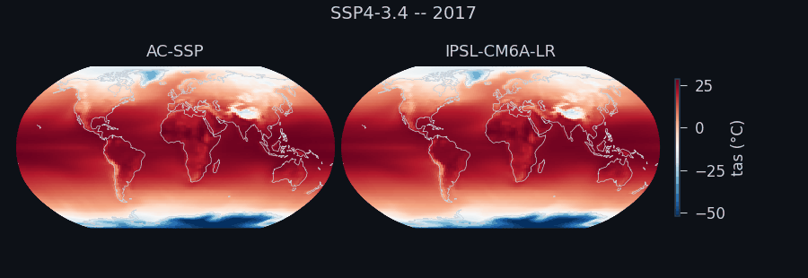
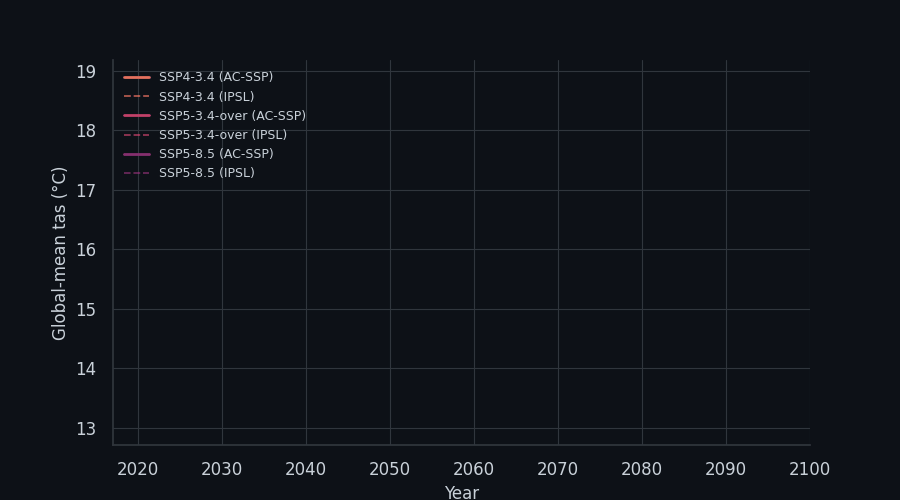

# ArchesClimate-SSP

ArchesClimate-SSP (AC-SSP) is a deep-learning climate emulator based on [ArchesWeather](https://www.science.org/doi/10.1126/sciadv.adx2372) trained to reproduce IPSL-CM6A-LR / CanESM5 monthly climate states under CMIP6 SSP scenarios. We condition AC-SSP on external forcings (GHGs, aerosols, ozone) given a scenario's forcing trajectory. With these forcings and two initial-condition months, AC-SSP generates autoregressively the rest of the scenario, orders of magnitude cheaper than
running the full Earth System Model (producing a subset of the variables).

This is the code for the paper
[**"Towards Emulating the Forced Response of Climate Models with Generative Machine Learning"**](https://arxiv.org/abs/2605.16929).
It's a long-ago fork of [geoarches](https://github.com/INRIA/geoarches), the toolkit behind 
[ArchesWeather](https://www.science.org/doi/10.1126/sciadv.adx2372).



*Annual-mean surface air temperature (tas), AC-SSP vs. the IPSL-CM6A-LR target it's conditioned to reproduce, SSP4-3.4*



*Rollouts across three scenarios (SSP5-3.4 starts at 2040) as a lat-weighted global-mean timeseries (solid: AC-SSP, dashed: IPSL). Regenerate both GIFs with `python -m analysis.make_readme_gif`.*

## Quickstart

We will walk through running inference with a published checkpoint:

1. **Install [uv](https://docs.astral.sh/uv/)** if you don't have it (installs to `~/.local/bin`,
   no root/admin needed):
   ```bash
   curl -LsSf https://astral.sh/uv/install.sh | sh
   ```
   (Windows/other options: see the [uv install docs](https://docs.astral.sh/uv/getting-started/installation/))

2. **Clone and install:**
   ```bash
   git clone https://github.com/grahamclyne/ArchesClimate-SSP.git
   cd ArchesClimate-SSP
   uv sync
   ```

3. **Download the checkpoints and the physical data.** First pick where the data (~60 GB) will
   live and set a shell variable for it:
   ```bash
   data_dir=~/ac_data   # or wherever you want it -- just not inside this repo
   mkdir -p "$data_dir"
   data_dir=$(realpath "$data_dir")
   ```
   Then download the datasets and data:
   ```bash
   # all three checkpoints, landing directly under $data_dir/model_output/cmip-interpolation/<name>/
   uv run hf download gclyne/ArchesClimate --local-dir "$data_dir/model_output/cmip-interpolation"

   # scenario/reference data
   uv run hf download gclyne/ArchesClimate-data --type dataset --exclude "stats/*" --local-dir "$data_dir"

   # normalization stats -- loaded from *this code repo's own* stats/ specifically, not from
   # $data_dir (see INFERENCE.md §3 for why), so it goes straight there instead
   uv run hf download gclyne/ArchesClimate-data --type dataset --include "stats/*" --local-dir .
   ```
   Three checkpoints are published: `archesclimate-ssp-deterministic`, `archesclimate-ssp-energy-score`
   (both IPSL-grid), `archesclimate-ssp-canesm5-energy-score` (CanESM5-grid).

4. **Run a rollout.** No config file to copy or edit -- `cluster=external` is a template with one
   value, `data_root`, and Hydra lets you set that value straight from the command line with
   `cluster.data_root=...`, same as any other override:

   On SLURM:

   ```bash
   sbatch analysis/long_rollout.sh module=archesclimate-ssp-deterministic name=archesclimate-ssp-deterministic \
       cluster=external cluster.data_root="$data_dir" module.dataset_path=ipsl_scenarios \
       inference.target=val inference.debug=False inference.save_all_vars=True inference.use_ema=True
   ```
   or without SLURM:

   ```bash
   uv run python -m analysis.long_rollout module=archesclimate-ssp-deterministic name=archesclimate-ssp-deterministic \
       cluster=external cluster.data_root="$data_dir" module.dataset_path=ipsl_scenarios \
       inference.target=val inference.debug=False inference.save_all_vars=True inference.use_ema=True
   ```

   `inference.device` defaults to `auto` (cuda if available, else cpu), so the commands
   above already run on CPU with no changes needed on a CPU-only machine -- pass
   `inference.device=cpu` explicitly only to force CPU on a machine that does have a GPU. Expect
   a CPU rollout to be far slower than on a GPU.

5. **Visualize a global-mean rollout** (same overrides as step 4):
   ```bash
   uv run python -m analysis.plot_global_mean_rollout module=archesclimate-ssp-deterministic name=archesclimate-ssp-deterministic \
       cluster=external cluster.data_root="$data_dir" module.dataset_path=ipsl_scenarios \
       inference.target=val inference.use_ema=True
   ```

See [`TRAINING.md`](TRAINING.md) for how to train your own model.
See [`INFERENCE.md`](INFERENCE.md) for what each of these inputs actually is and why.
